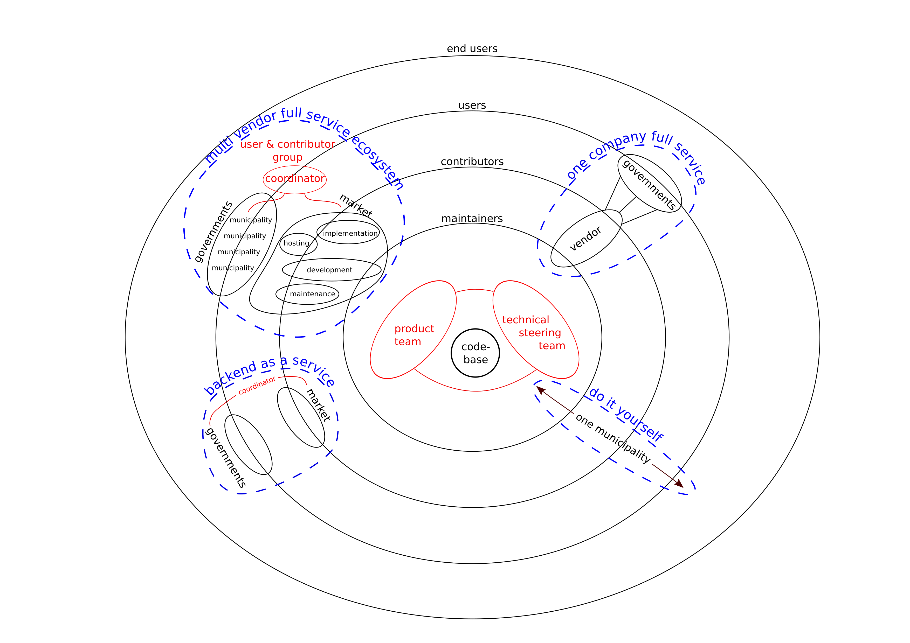

# Supporting governance

The development of public code requires various forms of governance. Codebase stewardship includes helping communities develop the governance models that best suit their specific situations. We recognize that governance is not "one size fits all", but rather something that needs to be adjusted to the culture, maturity, composition, and size of a community.

The Foundation for Public Code *does not* directly govern codebases. Instead, we offer support and advise on codebase governance, and help *communities* execute governance.

## What codebase governance is

Codebase governance is strictly limited to the codebase. The governance of the codebase should strive to be as simple, transparent and welcoming as possible. This is to help the codebase scale, and allow different types of parties; public associations, large and small municipaities, and different companies to get involved. The current draft ‘[governance file](governance-template.md)’ contains a proposal, including a technical steering team and product steering team.

### Codebase governance does not imply governance of implementations

Governance of implementations is whatever contextual arrangement is made to enable a local implementaiton. This can include contracting of marketing parties, collective procurements, or service agreements between municipal departments. For example, this could include a joint procurement by several municipalities, coordinated by an association of municipalities, for a consortium of market parties (including development, maintainenance and hosting parties).

Governance of implementations can vary strongly, ranging from one municipality who does everything in house, to municipalities who interact with a single market party for all their needs and questions. The market consultation is part of defining what these relationships should or could look like.

Below is a visual representation summarizing the information above.

## Determining a community's governance needs

Several basic questions need to be answered regardless of the [methods](../workshops/) used to determine these needs:

* How do you want to make decisions, large and small, around the codebase and the community?
  * Can certain issues only be decided by certain community members?
  * Can others be distributed and/or delegated to the wider community or specialists within the community?
  * Who decides which issues are reserved or delegated, and how can community members participate in the decision making process?

## Designing a governance model

After the community's governance needs have been established, a suitable governance model can be designed. [This governance template](governance-template.md) can be used as inspiration.

The following sections are typically included when designing a governance model:

* Principles
* Maintainership (teams, members and meetings)
* Changes in codebase governance
* Decision-making process
* Conflict resolution
* Intellectual property
* Code of conduct

The governance model is best documented in a `GOVERNANCE` file that is placed in the root catalog of the codebase repository and linked to from the `README` file.

## Standard compliance

[The Standard for Public Code](https://standard.publiccode.net) mentions several criteria related to governance.

### [Welcome contributions](https://standard.publiccode.net/criteria/open-to-contributions.html)

This criterion has several requirements that are related to the governance of a codebase. Firstly, it makes clear that a lot of things need to be publicly accessible and that things need to be openly documented. It then touches upon on how people can interact and what expectations they can have of the codebase. Lastly, it states that the governance itself should be documented in a GOVERNANCE file.

### [Require review of contributions](https://standard.publiccode.net/criteria/require-review.html)

This is the second criterion relevant for codebase governance. It mandates that contributions need to be approved by other parties in the community and specifies how this could be done.

## Anti-patterns

Some common [anti-patterns](https://en.wikipedia.org/wiki/Anti-pattern) that we have noticed are:

* The governance model is set up to require reviewer(s) from other organization(s).
  * If one organization makes 90% of the pull requests, the other organizations may not be able to keep up with that pace. If the model is too rigid, timely merging might become a problem.
  * If a majority (or all) of the reviewers are part of a single organization that doesn't dedicate time to reviewing code contributions from other organizations, the backlog of pull requests to review will grow. If the model is too rigid, timely merging might become a problem.
* A model requiring perfect consensus or even unanimous votes might get caught in decision paralysis if the voting members usually have different opinions.

## Workshop

The [governance game](game/index.md) and the [governance exercise](exercise/index.md) are useful tools to employ early in the process. It helps people reflect on what governances means for a codebase, the complexity around it, and suggests things worth considering during set up. It is also useful as a tool for visualizing how a current governance model is set up or could be changed.

## Further reading

* [Open Governance](https://github.com/opengovernance/opengovernance.dev) - a collection of governance models of open source projects (no public code examples there yet).
* Some easy tasks related to governance are listed in [Product assets for early incubation](../codebase-stewardship/product-assets-for-early-incubation.md).
